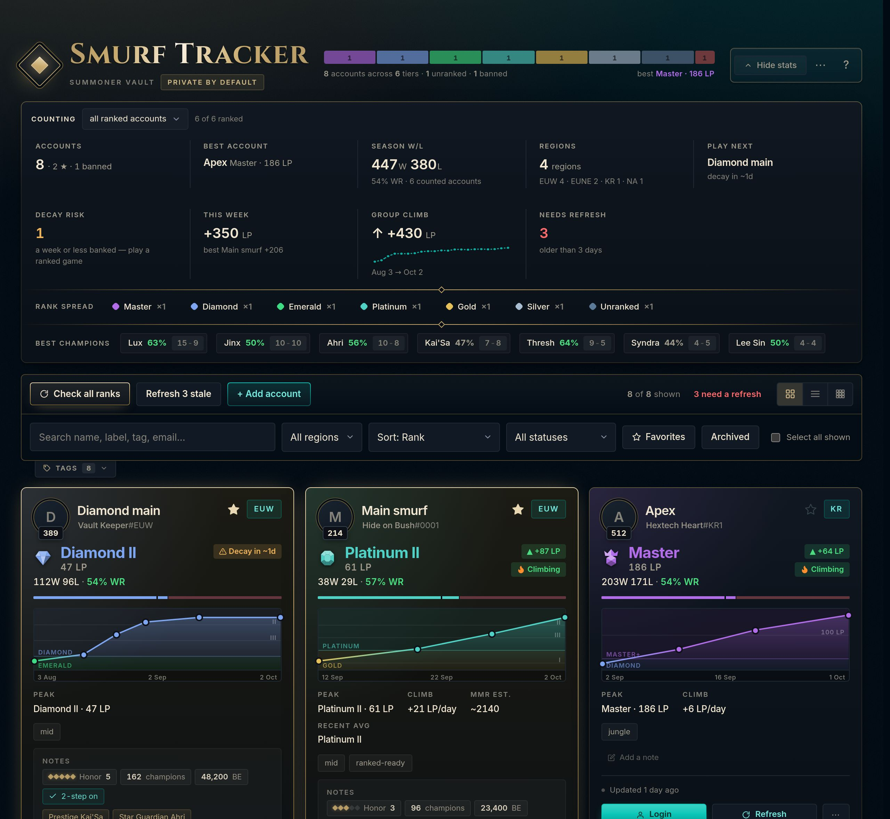
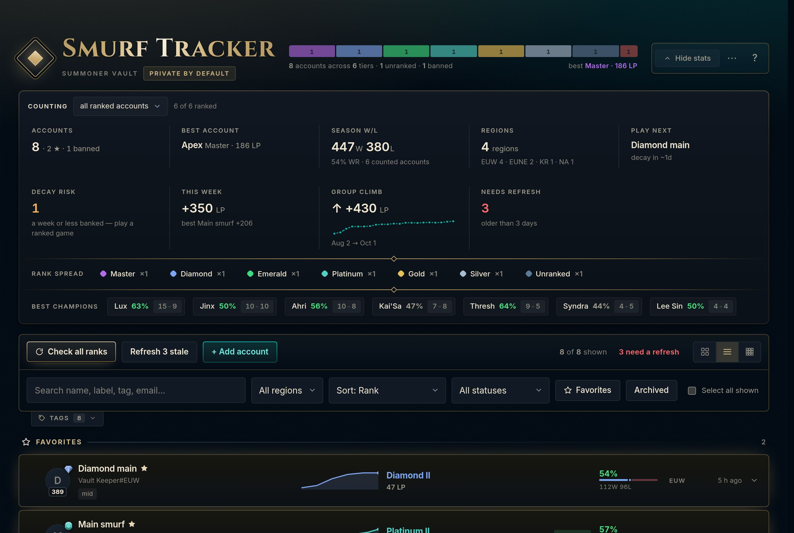
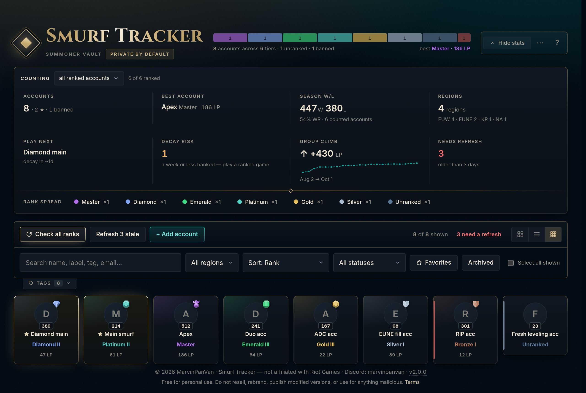
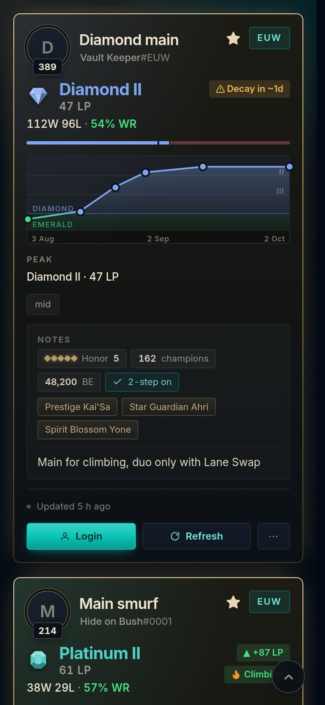
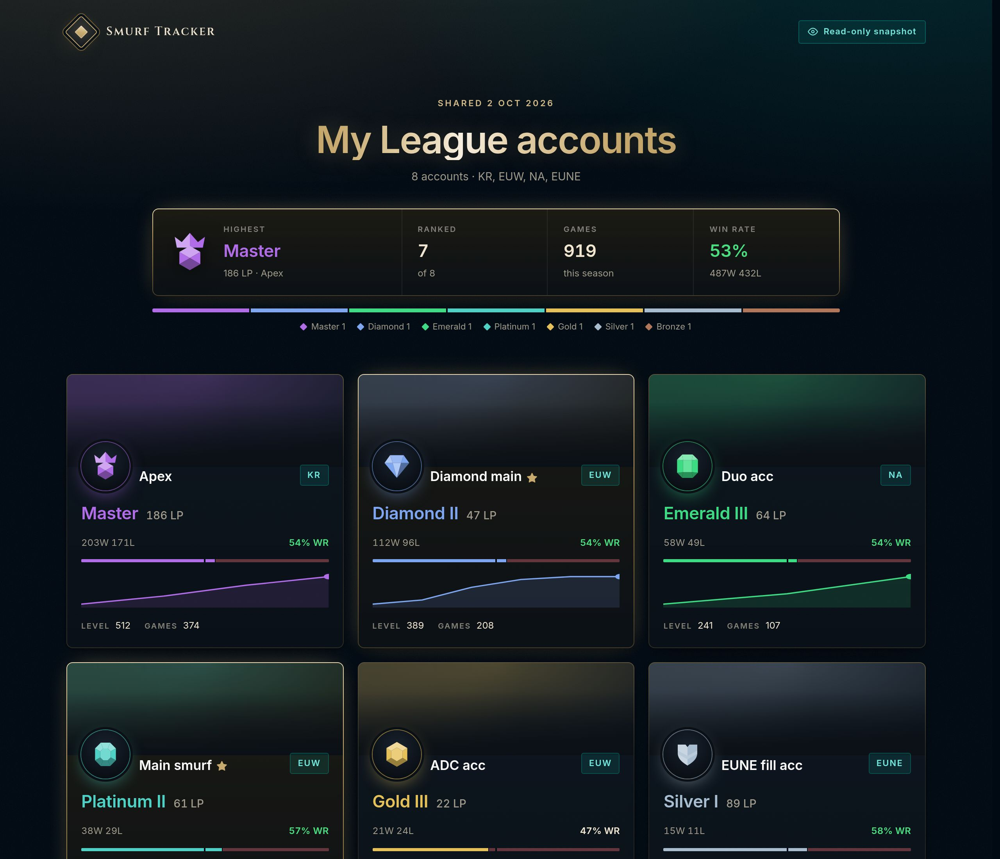

# Smurf Tracker

[](https://github.com/MarvinPanVan/league-smurf-tracker/actions/workflows/test.yml)
[](https://github.com/MarvinPanVan/league-smurf-tracker/releases)

Every League account you own in one place: rank, LP history, logins, notes. It runs in your browser with nothing to install, no sign-up and no server.

**[Open Smurf Tracker →](https://marvinpanvan.github.io/league-smurf-tracker/)**



## What it does

- **Ranks without the busywork.** One click checks every account. Each card shows the tier, LP, win rate and level, plus an LP chart that draws the ladder as bands, so a promotion looks like one. Past seasons, flex rank and your champions sit under **Details**.
- **Tells you what to play.** **Play next** picks the account that needs a game: one about to decay first, otherwise the one you have left longest. **Decay risk** estimates how many days a Diamond+ account has banked from the games seen between checks. **This week** sums up the last seven days, and **Needs refresh** counts the accounts whose rank is old. With your worker, **decay alerts reach your Discord** even while the app is closed.
- **Logins kept safe.** Username, password and email per account, hidden until you ask. Set a master password and everything is encrypted (AES-256, 600 000 PBKDF2 rounds), with auto-lock. **Copy username, then password** fills a login screen in two pastes, and copied passwords clear after 30 seconds.
- **Three layouts, your look.** Cards to browse, a list to work through a big vault, or a wall of rank crests to see the whole collection at once. Pick a theme (Hextech, Shadow Isles, Noxus, Piltover, Freljord, Ionia, Void, or one that follows your best rank), choose what each card shows, and set the effects and text size. Each card can carry champion art: its most-played champion by default, or any champion and skin you pick with **Card art…**.
- **Notes with fields.** Honor level, skins, champions owned, Blue Essence, 2-step verification and penalties, plus fields of your own (where an account came from, what it cost). Every card shows them the same way, and search finds them.
- **Share a snapshot.** A read-only page of your ranks in one link, to send a friend: best rank, games, win rate, then each account with its art and LP line. You choose which accounts and whether Riot IDs are shown. Logins, emails and notes are never in it, and nothing is uploaded: the link itself is the page.
- **Streamer mode.** Press <kbd>H</kbd> and Riot IDs, logins, emails and notes are blurred, so you can stream or share your screen.
- **Finds things fast.** Search names, tags, notes, skins and ranks, or combine filters like `>diamond is:stale`, `region:euw`, `is:decay`, `champ:yasuo` or `role:mid`. Accounts still levelling show how far they are from 30, and `is:ready` lists the ones that can play ranked.
- **Backups and sync.** Export a plain or encrypted backup, add many accounts at once (a list of `Name#TAG`s, an op.gg multi-search link or the lobby chat), or sync phone and PC through your own worker. Only the encrypted vault is uploaded. A new split? **New season** moves every rank into Past seasons in one go.

| List | Wall | Phone |
|---|---|---|
|  |  |  |

**A shared snapshot**, as a friend sees it:



## Get started

1. **[Open the app](https://marvinpanvan.github.io/league-smurf-tracker/)**. Want to look around first? **Preview with example data** shows it full, and saves nothing.
2. **+ Add account**, then paste a Riot ID like `Faker#KR1` into the name field: it splits itself.
3. Follow **Get set up**: check ranks, set a master password, back up.
4. **Install it** (your browser's *Install app*, or *Add to Home Screen* on iPhone). It opens like an app and works offline. On iPhone this also stops Safari deleting your data after 7 days away.

Your data lives in this browser only. Read **[SECURITY.md](SECURITY.md)** for exactly what is stored, what is encrypted, and what ever leaves your device. In short, keep a backup.

## Optional: your own worker

Out of the box, rank checks read op.gg through free public proxies. That works most of the time, but the proxies are other people's servers and can be slow or down. Your own [Cloudflare Worker](cloudflare-worker.js) is free, takes about five minutes, and gets you:

- faster, more reliable checks, plus the champion table and the dates your LP was actually reached;
- **device sync** (the encrypted vault, nothing else);
- with a Riot API key: ranks straight from Riot, accounts that keep their history when renamed, your **last 5 ranked games**, win streaks and roles, and **champion mastery** under Details;
- **decay alerts on Discord** (Settings → Alerts), checked once a day even when the app is closed.

[](https://deploy.workers.cloudflare.com/?url=https://github.com/MarvinPanVan/league-smurf-tracker)

1. Click **Deploy to Cloudflare** and sign in (a free account is enough).
2. Cloudflare copies this repo into your GitHub account. Keep that copy private: it is yours alone, as the [terms](#terms-of-use) allow.
3. It asks for `RIOT_API_KEY`. Paste a key if you have one (see below), or leave it empty for now.
4. When it finishes, copy the `https://….workers.dev` address.
5. In the app: **Settings → Backend URL**, paste it, **Save**. The line under the field says what your worker has: the Riot key, and sync storage.

<details>
<summary>Without the button (paste the code by hand)</summary>

1. [dash.cloudflare.com](https://dash.cloudflare.com) → **Workers & Pages** → **Create** → **Create Worker** → name it → **Deploy**.
2. **Edit code** → paste the whole of [`cloudflare-worker.js`](cloudflare-worker.js) → **Deploy**.
3. For sync and alerts: **Storage & Databases → KV** → create a namespace, then in the worker **Settings → Bindings → Add → KV namespace**, variable name `VAULT`. For alerts, also add a Cron Trigger `17 9 * * *` under **Settings → Triggers**.
4. Copy the `workers.dev` address into **Settings → Backend URL** in the app.

</details>

### A Riot API key

With a key, your worker asks Riot's own API. Without one, it reads op.gg.

1. Sign in at [developer.riotgames.com](https://developer.riotgames.com) with your Riot account and accept the developer terms.
2. Your dashboard shows a **Development API Key** straight away. It works at once but **expires every 24 hours**, so it is for trying things out.
3. For a key that lasts, choose **Register Product → Personal API Key** and describe the tool: something like *"A personal tracker for my own League accounts: it reads their rank and recent ranked games. Only I use it."* Riot reviews the request, which can take a while.
4. Put the key in your worker: Cloudflare dashboard → **Workers & Pages** → your worker → **Settings → Variables and Secrets → Add**. Choose type **Secret**, name it `RIOT_API_KEY`, paste the key and **Deploy**.
5. Reopen **Settings** in the app. It should say **Riot API key: set**.

A personal key allows 100 requests every 2 minutes, roughly 40 accounts. A bigger **Check all** gets the rest from op.gg, so nothing fails. If the key expires or is wrong, the app says so once and carries on with op.gg.

### Device sync

1. Set a **master password**; only the encrypted vault is ever uploaded.
2. With the Backend URL saved, **Generate** a sync token in Settings.
3. On each device, use the **same token and the same master password**, then **Push to cloud** and **Pull from cloud**. The newest write wins, and you are warned if the other side is newer.

Keep every synced device on the latest version: since 2.1 the vault uses stronger encryption, which older versions cannot open. Reloading the page updates it.

### Decay alerts on Discord

1. In Discord: **Server Settings → Integrations → Webhooks → New Webhook**, pick the channel, **Copy Webhook URL**.
2. In the app: **Settings → Alerts**, paste it, tick **Decay alerts on Discord**, **Save**.

Once a day your worker re-reads your Diamond+ accounts and posts when one is about to decay, or has started to: once per change, not every day. For this it keeps a short list on your worker: those accounts' Riot IDs, labels and decay estimates, never logins.

**Deployed your worker before 2.2?** It needs the new code and its daily trigger. Click **Deploy to Cloudflare** again, or paste the new [`cloudflare-worker.js`](cloudflare-worker.js) into your worker and add a Cron Trigger `17 9 * * *` under its **Settings → Triggers**. The app says so if your worker is too old.

## Development

`index.html` is the whole app: one file, no build step. The test suite in [`tests/`](tests/) boots that exact file in jsdom with Node's built-in runner, so nothing is copied into the tests and a red test means the shipped page is wrong. It covers the op.gg parsers against real markup, the ladder maths, escaping, the vault encryption, the worker, and a regression test for every bug fixed so far.

```bash
cd tests
npm install
npm test
```

**Releasing.** Bump `APP_VERSION`, add its entry to `APP_CHANGELOG` (the in-app toast shows the first two lines), and bump the cache name in `sw.js`. When the tests pass on `main`, a GitHub Release is published automatically, with that changelog entry as its notes.

## Terms of use

This project is **source-available, not open source** — see [LICENSE](LICENSE) for the full text. In short:

**You may** use it for free for your own personal use, share it by linking to this repo or the hosted version, and keep a private copy or fork for yourself and your friends.

**You may not** use it for anything malicious or unlawful (including accessing accounts you don't own, or breaking Riot's terms of service), publish a modified/rebranded/rewritten version of it, sell it or bundle it into anything paid, or present it as your own work.

Found a bug or want a feature? Open an issue — contributions and suggestions are welcome.

## Credits

Made by **MarvinPanVan** · Discord: `marvinpanvan`

## Not affiliated with Riot Games.
